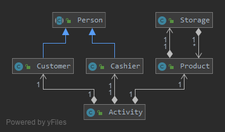
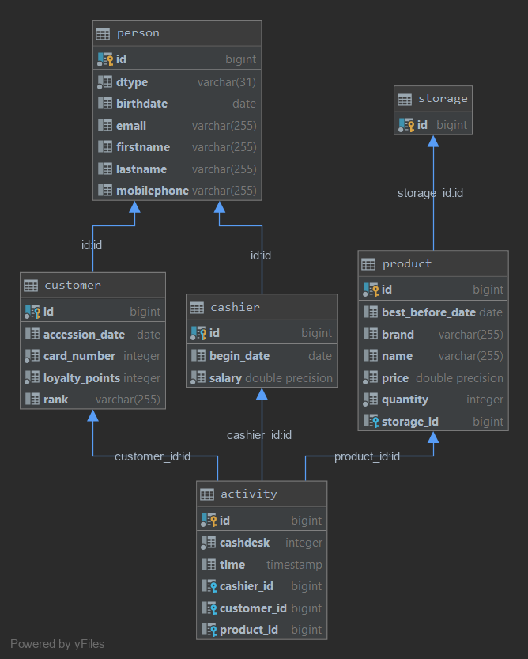

# Quarkus JPA by Philipp Auinger
Erläuterung: Ein Supermarkt wird realisiert.

### Struktur:
* Cashier - Kassier
* Customer - Kunde der ein Produkt kaufen kann
* Product - Produkt
* Activity - Aktivität (Verbindungstabelle zwischen Cashier, Product, Customer)
* Storage - Lager (mehrere Produkte die abgespeichert werden, Lagerort wird abgespeichert)

## Docker Command (DB)
    docker run --name some-postgres -p 5432:5432 -e POSTGRES_PASSWORD=passme -d postgres --rm

## Starten:
    mvn compile quarkus:dev

## Swagger - UI - Übersicht:
    http://localhost:8080/swagger-ui

### Installiert mit:     
    mvn quarkus:add-extension -Dextensions="openapi"

## Supermarket Klassendiagramm
     

## Supermarket ERD

